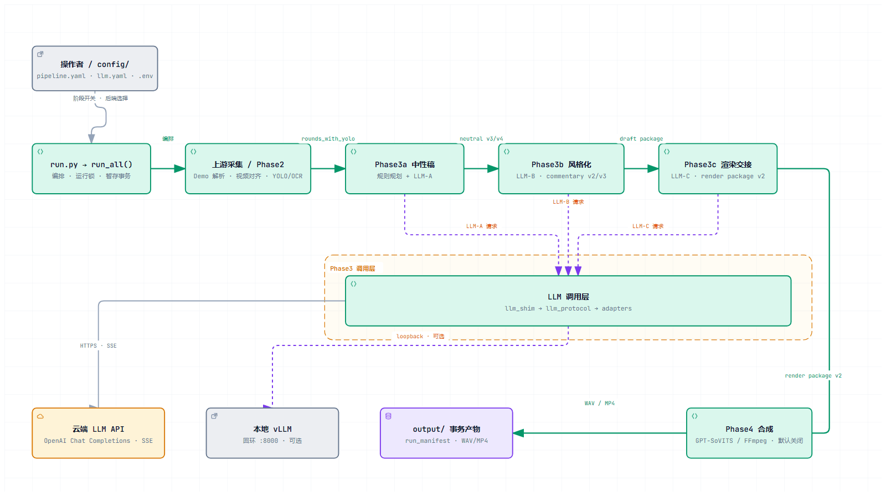

# sbmachine

> “玩出又不播100t，if机器还认他爸刘农就好了...”

sbmachine 是一个把「一段 CS2 录像 + 它对应的 demo」变成「一段带解说的视频」的离线流水线。虽然以目前阶段的质量来看，它更像一个 **demo 流水报告生成器**。


## 工作流

```text
输入: 视频(.mp4) + demo(.dem)
  │
  ├─ Phase1   demo 解析与回合拆分
  ├─ Phase2   tick↔视频时间轴对齐 + YOLO/OCR 画面解析
  ├─ Phase3a  规则层 + 中性语义分析 (LLM-A)
  ├─ Phase3b  人设/风格解说生成 (LLM-B)
  ├─ Phase3c  LLM-C 渲染润色（可选开关）
  └─ Phase4   GPT-SoVITS 配音 + 音视频合成
输出: output/sbmachine/ 下逐阶段 JSON + 逐局 WAV/MP4
```

<picture>
  <source media="(prefers-color-scheme: dark)" srcset="docs/diagrams/ai6657-architecture.dark.png">
  
</picture>

**动图导览**（全图 → 主链路 → Phase3 调用层 → 可选后端，自动轮播）：



中间产物默认统一放 `output/sbmachine/`：

```text
rounds_with_yolo_semantic.json   Phase2 事实帧时间轴
  → llmb_draft_package.json      Phase3b 出口封存
  → commentary_render_package.json  Phase3c 渲染包
  → rounds_final.json / assemble_manifest.json / 逐局 WAV·MP4
```

## 快速开始

### 1. 环境要求

- 一个可访问的 **OpenAI 兼容 LLM 端点**（本地或云端，见下）
- Phase4 配音需另装 **GPT-SoVITS** 服务（见下文）

### 2. 安装

```bash
pip install -r requirements.txt
```

### 3. 接入模型

本项目不限定 vLLM。只要你的服务暴露 `POST /v1/chat/completions`就能用：

| 场景 | 配置方式 |
|---|---|
| 本地服务（vLLM / Ollama / LM Studio 等） | `.env` 里 `AI6657_LOCAL_BASE_URL`（默认 `http://127.0.0.1:8000/v1`）、`AI6657_LOCAL_API_KEY`、`AI6657_LOCAL_MODEL` |
| 云端 API（任意 OpenAI 兼容） | `.env` 里 `AI6657_CLOUD_BASE_URL`、`AI6657_CLOUD_API_KEY`、`AI6657_CLOUD_MODEL` |


`config/llm.yaml` 中 `backend: api | vllm` 决定走云端还是本地，`analyst_backend` / `style_backend` 可分别指定。纯云端模式在执行Phase3**不需要 GPU**。

### 4. 配置

所有配置在 `config/`，多个 YAML 按字母序自动合并：

| 文件 | 说明 |
|---|---|
| `pipeline.yaml` | 阶段开关、路径、Phase4 发布档位（legacy/strict） |
| `llm.yaml` | 后端选择、采样参数、并发、缓存、会话 |
| `yolo.yaml` | Phase2 视觉参数（YOLO 权重、POV/timer/score OCR） |

产物路径不必逐个配置：只要给 `paths.output_dir`，其余自动按固定文件名放入。

### 5. 运行

```bash
python run.py                # 跑完整流水线（读 config/）
python run.py --dry-run      # 仅 JSON 链路预检，不调任何 AI 模型
python run.py --debug        # 纯文本调试模式，末尾输出可解析 JSON
```

阶段开关见 `config/pipeline.yaml` 的 `phases:`，`runtime.manage_services` 控制是否由编排器自动拉起 vLLM / GPT-SoVITS。

### 6. GPT-SoVITS（Phase4 配音）

无论本地还是云端分支都需另装 GPT-SoVITS，推荐官方一键整合包，后台启动即可，默认 API 端口 **9880**。

## 测试

```bash
python -m pytest tests -q                      # 全量（默认不联网/不碰真实模型）
python -m pytest tests --collect-only --strict-markers -q   # 检查 marker 注册
```

## 目录结构

```text
run.py                # 唯一启动入口
config/               # 配置（pipeline / llm / yolo）
sbmachine/            # 核心流水线（阶段、事务、预检、LLM 调用层）
core/                 # 配置加载、prompt 加载
Prompt/               # 各阶段提示词与规则
audio_service/        # GPT-SoVITS 客户端与运行时配置
vision_service/       # 画面/区域辅助
database/             # 玩家别名、地图等静态数据
tools/                # 辅助脚本（demo 解析、切片、调试）
tests/                # 契约 + 单元测试
docs/                 # 维护者深度文档（架构 / 模块 / 测试）
```


## 已知问题

因为纯粹个人独自编写，且时间有限，所以会出现诸多纯粹 vibe 和本机上没遇到的问题，如果你在使用中遇到问题，欢迎提 issue，我会尽量修复。

1. 可能只支持 30/60 帧的视频，其他帧率可能出问题
2. `run.py` 的自主拉起进程功能可能不可靠，推荐手动拉起放后台

## Roadmap

**近期**

1. 改善 phase3 逻辑，输出更好的解说文本
2. 补充 phase3a 的战术层和地图层，让解说更自然
3. 改善 phase4 配置，适配更多视频帧率
4. 实测本地模型的 phase4，确保可行性

**更远**

1. 重构 phase2 视觉层，让 phase3 能收到画面数据
2. 把玩宝宝炼成 skill，让 phase3 更贴
3. 把 `run.py` 的拉起机制做到完全自动

## 贡献

如果喜欢，欢迎各位大佬提 PR 或 issue。

## 后记
本来就是想复刻下玩宝宝的解说风格的，但是一下子就干了三个月，只能说这口猪头肉太好吃了，可是还是复刻不出来玩宝宝的节奏，太可惜了😭😭😭

因为使用的cnb当作镜像站，所以顺手也将训练端代码发布在那边，这边只做调用端的发布，显得这边git记录有点“乱”，反正大致就是进行一次大更新就是了）

估计也暂时告一段落，后续有机会再慢慢优化更新

此外Phase1相关的两个模型以及GPT-SoVITS的相关权重我放在release去，供大家下载自己导入使用吧


## 致谢

- [demoinfocs-golang](https://github.com/markus-wa/demoinfocs-golang) —— CS2 demo 解析能力构建于此（MIT License）。感谢 markus-wa 及所有贡献者
- [GPT-SoVITS](https://github.com/RVC-Boss/GPT-SoVITS) —— GPT-SoVITS 音频生成能力构建于此（MIT License）。感谢 RVC-Boss 及所有贡献者
- [archify](https://github.com/tt-a1i/archify) —— archify README文档的图片是基于此构建的（MIT License）。感谢 tt-a1i 及所有贡献者